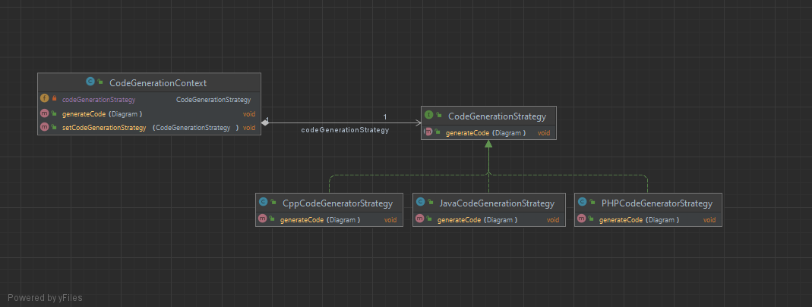

## Examen Design Pattern et Programmation Orientée Aspect

On souhaite créer une Framework qui permet de Générer des diagrammes UML d’un modèle ainsi que
le code source de l’application avec différents langages (Java, C#, etc...).
Un Modèle UML se compose de plusieurs Diagrammes. Il existe différents types de diagrammes :
Digramme de classe, Diagramme Use case, Diagramme de séquences, Diagramme d’Objets, etc. Dans
ce problème, nous nous intéresserons uniquement au diagramme de classe.

1. Définir une opération qui permet de générer le code source d’un diagramme de classes en
   choisissant une stratégie de génération pour chaque langage de programmation. Le modèle
   doit rester extensible pour donner la possibilité d’ajouter de nouvelle implémentation pour
   d’autres langages futurs. Dans cette application, il est demandé de définir une implémentation
   qui permet de générer le code java du diagramme de classe qui consiste à générer la structure
   des classes, interfaces, enumérateurs, annotations du diagramme de classe en prenant en
   considération les relations en entre ses différentes entités.

**Pour cela on va utiliser le design pattern Strategy qui permet de définir une famille d’algorithmes,
d’encapsuler chacun d’eux et de les rendre interchangeables. La stratégie permet de faire varier
l’algorithme indépendamment des clients qui l’utilisent.**




2. Exporter un diagramme de classes en différents formats : Sérialisation Binaire, XML, JSON, SVG
   etc. en laissant le modèle ouvert aux extensions futurs.

Pour cela on va utiliser le design pattern Strategy


3. Définir un aspect de journalisation en utilisant une annotation @Log pour journaliser toutes
   actions effectuées sur le diagramme de classes

On va ajouter la dépendance suivante dans le pom.xml pour utiliser l’annotation @Log

```xml
 <dependencies>
        <dependency>
            <groupId>org.aspectj</groupId>
            <artifactId>aspectjrt</artifactId>
            <version>1.9.7</version> 
        </dependency>
</dependencies>
```

On va créer un aspect LogAspect qui permet de journaliser toutes actions effectuées sur le
diagramme de classes. Pour cela on va utiliser l’annotation @Log qui permet de journaliser
toutes actions effectuées sur le diagramme de classes.

````java
@Target(ElementType.METHOD)
@Retention(RetentionPolicy.RUNTIME)
public @interface Log {
}
````

* LogginAspect.java

````java
@Aspect
public class LoggingAspect {

    @After("@annotation(Log)")
    public void log(JoinPoint joinPoint) {
        System.out.println("Action logged: " + joinPoint.getSignature().toShortString());
    }
}
````

4. Définir un aspect de verrouillage en utilisant une annotation @Lock pour verrouiller toutes
   actions effectuées sur le diagramme de classes
* LockingAspect.java

````java
@Aspect
public class LockingAspect {

    @Around("@annotation(Lock)")
    public Object lockMethod(ProceedingJoinPoint joinPoint) throws Throwable {
        System.out.println("Method locked: " + joinPoint.getSignature().toShortString());
        return null;
    }
}
````
5. Donner la possibilité de créer des groupes de classes qui peuvent contenir d’autres groupes

Pour cela on va utiliser le design pattern Composite qui permet de créer des groupes de classes
qui peuvent contenir d’autres groupes.


6. Adapter une ancienne implémentation qui permet de générer le code en l’intégrant comme
   stratégie de générer de code du Framework

Pour cela on va utiliser le design pattern Adapter qui permet d’adapter une ancienne
implémentation qui permet de générer le code en l’intégrant comme stratégie de générer de code
du Framework.


7. Quand l’état d’un attribut d’une classe change, d’autres observateurs (à définir) de
   l’application sont notifiés.

Pour cela on va utiliser le design pattern Observer qui permet de définir un mécanisme de
notification automatique à tous les objets qui dépendent d’un autre objet (sujet) quand son état
change.


* Observer.java

````java
public interface Observer {
    void update(String attributeName, Object newValue);
}
````
* Observable.java

````java
public interface Observable {

   List<Observer> observers = new ArrayList<>();

   public void addObserver(Observer observer);
   public void removeObserver(Observer observer);
   public void notifyObservers(String attributeName, Object newValue);

}
````

* ObservableImpl.java

````java
public class ObservableImpl implements Observable {
   private List<Observer> observers;

   public void addObserver(Observer observer) {
      observers.add(observer);
   }

   public void removeObserver(Observer observer) {
      observers.remove(observer);
   }

   public void notifyObservers(String attributeName, Object newValue) {
      for (Observer observer : observers) {
         observer.update(attributeName, newValue);
      }
   }

}
````


